# LinguaLife — Flujo Completo de la Aplicación

Documento técnico que mapea toda la aplicación: contexto, modelo de datos, flujos de negocio y diagramas de cada funcionalidad implementada y planeada.

---

## 1. Contexto de la Aplicación

**LinguaLife** es una plataforma de aprendizaje de inglés basada en el método **Logic Decoder System (LDS)** — trata el inglés como matemáticas: `Sujeto + Palabra-Temporal + Acción`. La plataforma conecta estudiantes colombianos con profesores en sesiones 1-a-1 o grupales, potenciadas por IA (Google Gemini).

**Tech Stack**: Next.js 16 (Pages Router) + React 19 + TypeScript + Airtable (DB) + Google Gemini 2.5 Flash + Vercel (deploy)

**Roles de Usuario**:
- **Estudiante**: Reserva clases con tokens, sigue el currículo, recibe ejercicios AI
- **Profesor**: Dicta clases con slides AI, gestiona agenda, califica progreso
- **Admin**: Gestiona usuarios, crea grupos, genera clases masivas, monitorea métricas

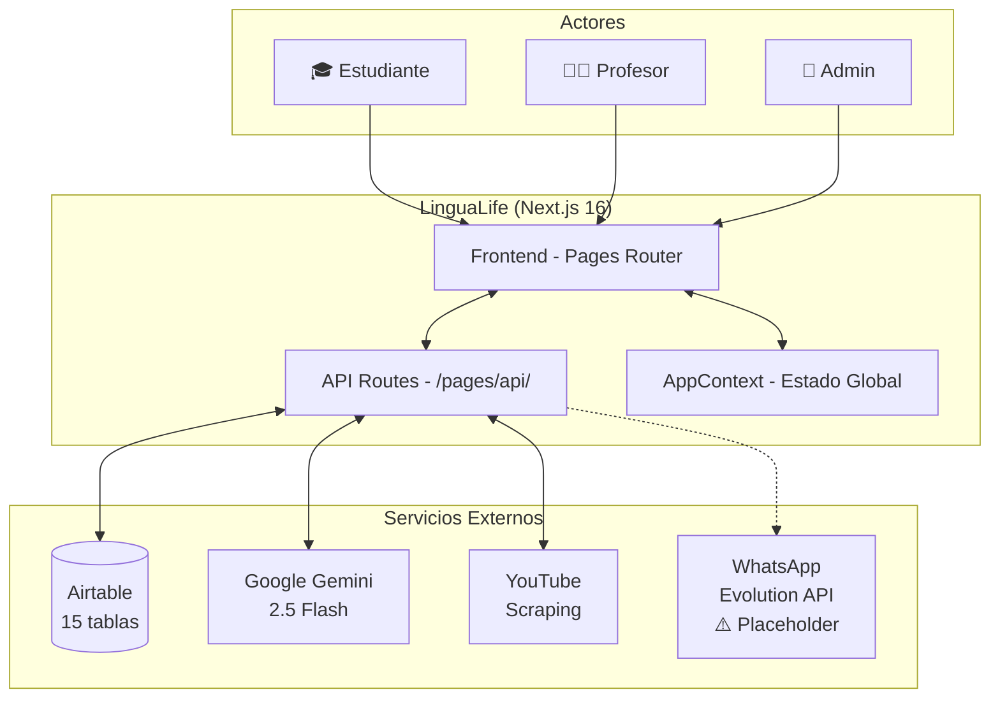

### Archivos Clave
- `context/AppContext.tsx` — Estado global: teacher, student, session, topic, exercises
- `types/index.ts` — Tipos: Teacher, AuthTeacher, Session, Student, Topic, Exercise
- `lib/airtable.ts` — Cliente Airtable: fetch, find, fetchRecord, patch, create, delete

---

## 2. Modelo de Datos (Airtable)

Airtable actúa como base de datos relacional con 15+ tablas conectadas por campos de tipo Link.

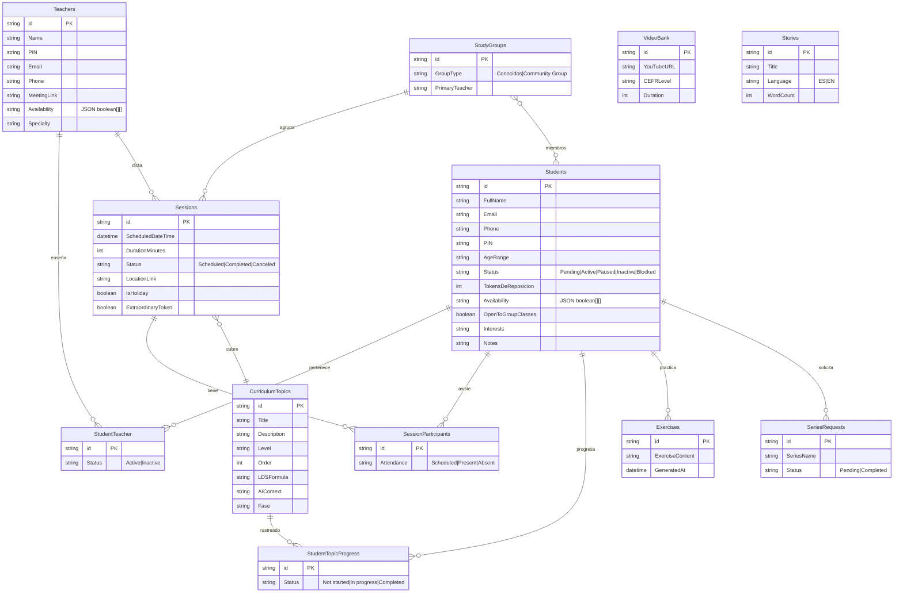

### Archivos Clave
- `lib/airtable.ts` — 6 funciones CRUD genéricas contra Airtable REST API
- `types/index.ts` — Interfaces TypeScript de las entidades principales

---

## 3. Autenticación y Enrutamiento

Login unificado por PIN. No hay JWT ni sesiones server-side — se usa `sessionStorage` del navegador.

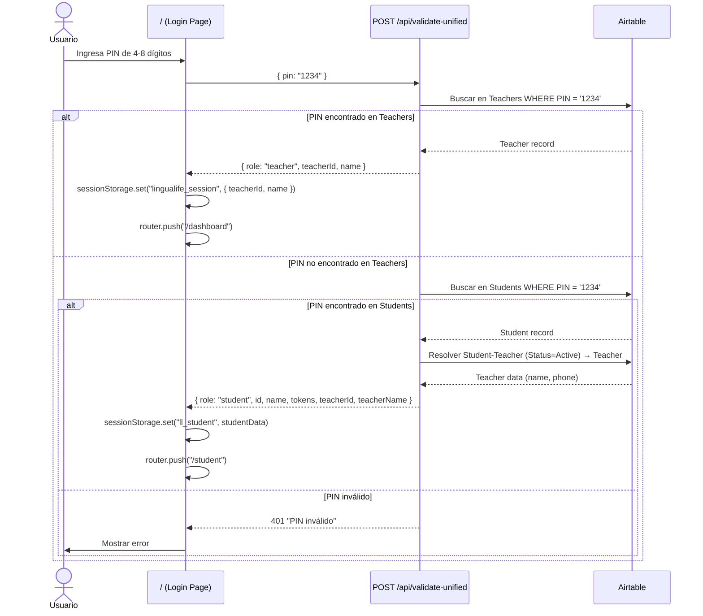

### Guard de Autenticación (Profesores)

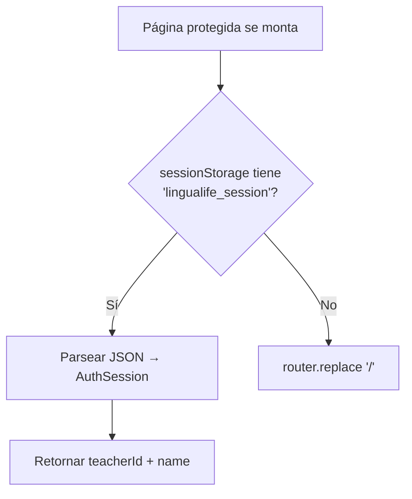

### Autenticación Admin

El admin usa un token hardcoded `LinguaAdmin2025` enviado en el header `x-admin-token`. No hay página de login — se ingresa directamente a `/admin`.

### Archivos Clave
- `pages/index.tsx` — Página de login con PinInput
- `pages/api/validate-unified.ts` — Endpoint que busca en Teachers → luego Students
- `hooks/useRequireAuth.ts` — Guard hook para páginas de profesor
- `components/PinInput.tsx` — Componente de entrada de PIN

---

## 4. Registro de Usuarios

### 4.1 Registro de Estudiante (`/register/student`)

Wizard de 5 pasos. Al completar, se crea un record en Students con Status = "Pending".

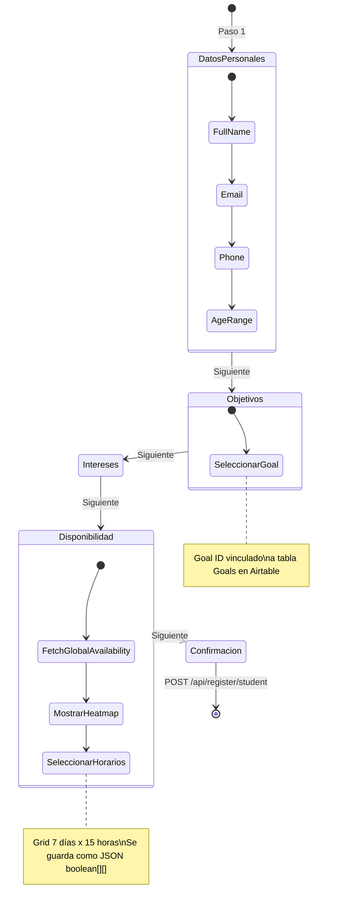

**Datos recolectados**: fullName, email, phone, ageRange, goalId, interests, availability (JSON grid), openToGroups

### 4.2 Registro de Profesor (`/register/teacher`)

Wizard de 4 pasos. Se crea record en Teachers.

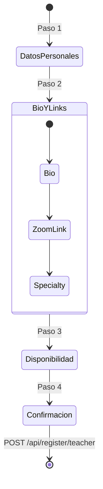

### Disponibilidad Global

Antes de que el estudiante seleccione horarios, se consulta `GET /api/register/global-availability` que agrega la disponibilidad de toda la comunidad para mostrar un heatmap de horarios populares.

### Archivos Clave
- `pages/register/student.tsx` — Wizard de registro estudiante
- `pages/register/teacher.tsx` — Wizard de registro profesor
- `pages/api/register/student.ts` — Crea record con field IDs directos de Airtable
- `pages/api/register/teacher.ts` — Crea record en Teachers
- `pages/api/register/global-availability.ts` — Heatmap de disponibilidad comunitaria
- `pages/api/register/community-availability.ts` — Overlap de disponibilidad

---

## 5. Dashboard del Profesor (`/dashboard`)

### 5.1 Agenda de Sesiones

El profesor ve sus clases del día organizadas por hora. Cada sesión se muestra como un `SessionCard` con estado, nombre del estudiante, tema y acciones disponibles.

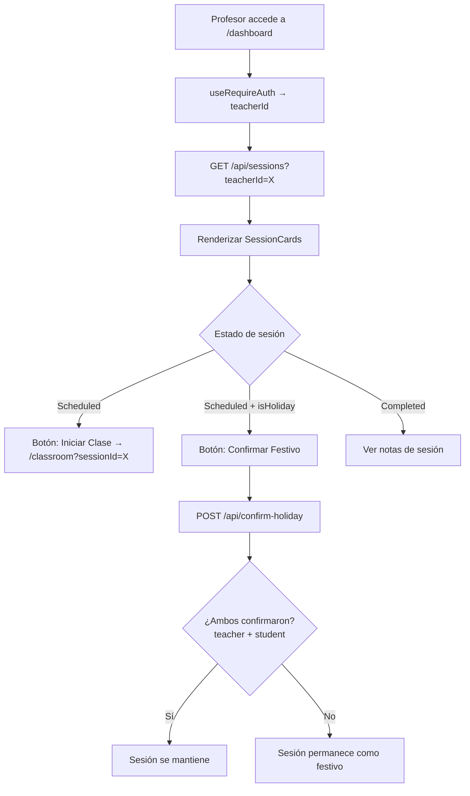

### 5.2 Classroom — Flujo de Clase (`/classroom`)

El corazón de la plataforma. Protocolo de 60 minutos en 3 fases con timer integrado, slides generados por Gemini, y AI Copilot.

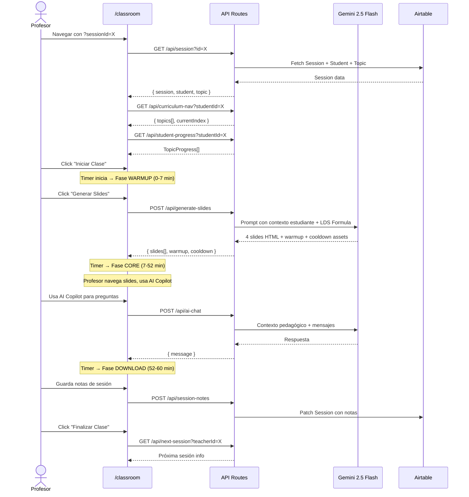

### Fases del Timer

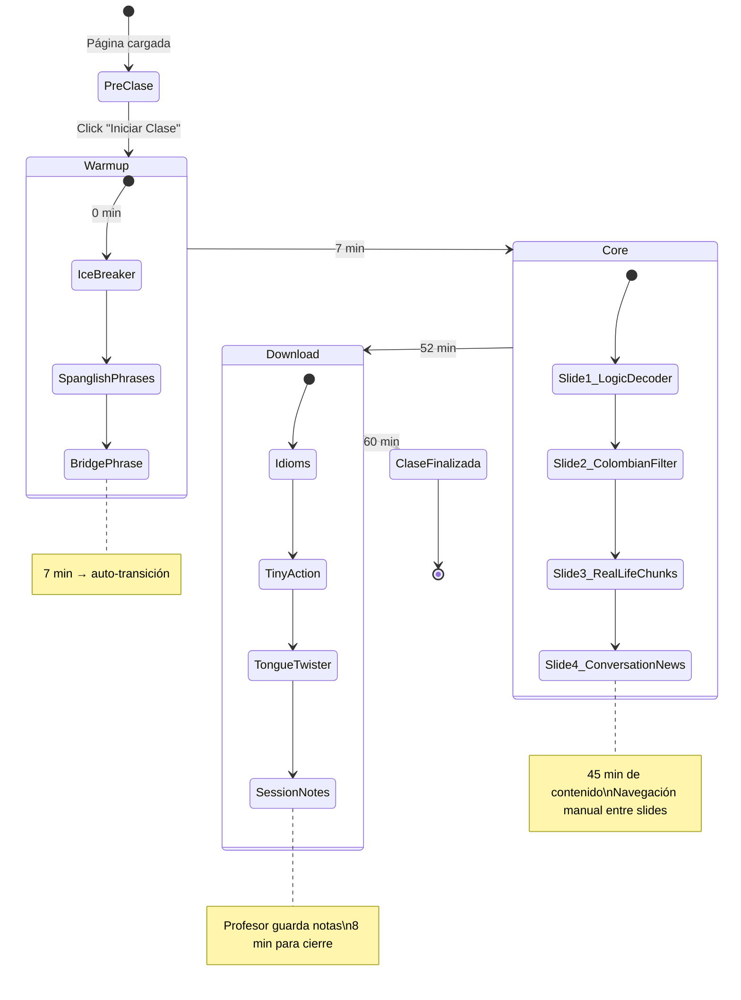

### 5.3 Gestión de Disponibilidad

Grid interactivo de 7 días x 15 horas (6am-8pm). Drag-to-select para marcar bloques. Se guarda como JSON `boolean[][]` en Airtable.

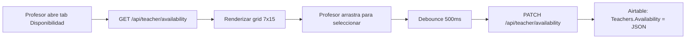

### 5.4 Confirmación de Festivos

Las sesiones en festivos colombianos requieren confirmación de ambas partes (profesor y estudiante).

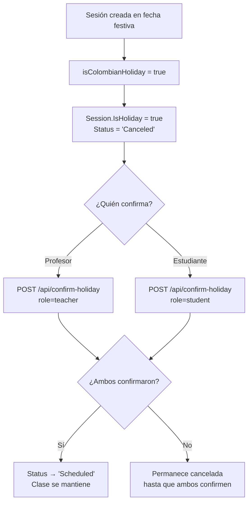

### 5.5 Studio

El profesor accede a datos de sus estudiantes y currículo via `GET /api/studio` que retorna estudiantes con su progreso curricular.

### Archivos Clave
- `pages/dashboard.tsx` — Dashboard principal del profesor (tabs Agenda/Studio)
- `pages/classroom.tsx` — Sala de clase con timer, slides, AI copilot
- `components/SessionCard.tsx` — Card de sesión reutilizable
- `pages/api/sessions.ts` — CRUD de sesiones
- `pages/api/generate-slides.ts` — Generación de slides via Gemini
- `pages/api/ai-chat.ts` — AI Copilot para el profesor
- `pages/api/session-notes.ts` — Guardar notas de sesión
- `pages/api/confirm-holiday.ts` — Confirmación dual de festivos
- `pages/api/teacher/availability.ts` — CRUD de disponibilidad
- `pages/api/curriculum-nav.ts` — Navegación del currículo
- `pages/api/student-progress.ts` — Progreso del estudiante
- `lib/holidays.ts` — Lista de festivos colombianos 2026 + `isColombianHoliday()`

---

## 6. Dashboard del Estudiante (`/student`)

### 6.1 Vista General

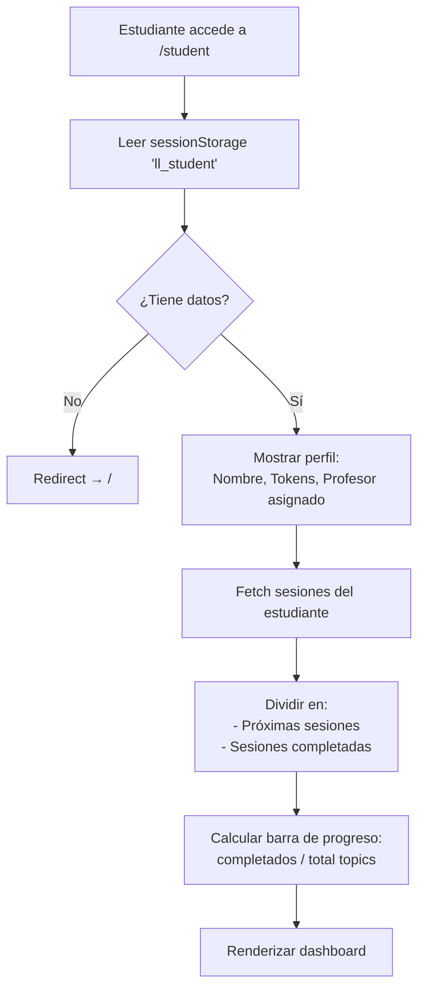

### 6.2 Reagendamiento con Tokens (Flujo más complejo)

El estudiante puede reagendar una clase gastando un token. Si pertenece a un grupo "Conocidos", **se cobra a todos los miembros**. Regla de 24h mínimo de anticipación.

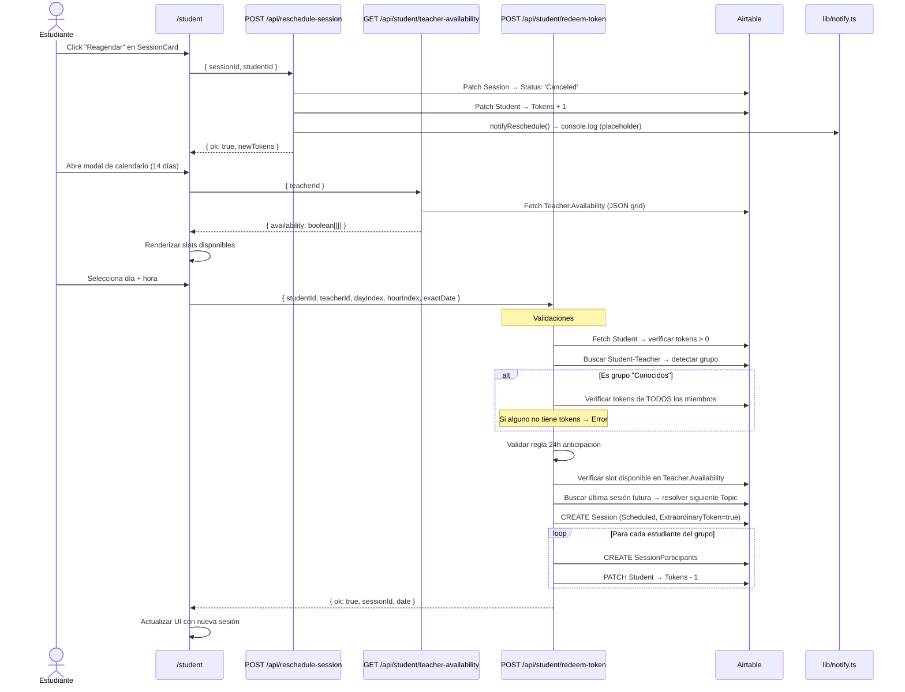

### 6.3 Calificación del Profesor

Después de una clase completada, el estudiante puede calificar al profesor.

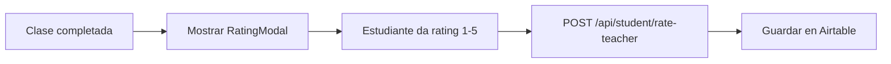

### 6.4 Solicitud de Series TV

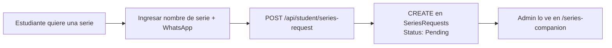

### Archivos Clave
- `pages/student.tsx` — Dashboard completo del estudiante
- `pages/api/student/redeem-token.ts` — Lógica de redención (group-aware, 24h rule)
- `pages/api/student/teacher-availability.ts` — Disponibilidad del profesor
- `pages/api/student/rate-teacher.ts` — Rating post-clase
- `pages/api/student/series-request.ts` — Solicitar serie TV
- `pages/api/reschedule-session.ts` — Cancelar sesión + devolver token

---

## 7. Panel de Administración (`/admin`)

Acceso protegido por header `x-admin-token: LinguaAdmin2025`.

### 7.1 Métricas (Overview)

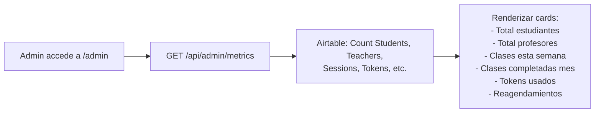

### 7.2 CRUD Estudiantes y Profesores

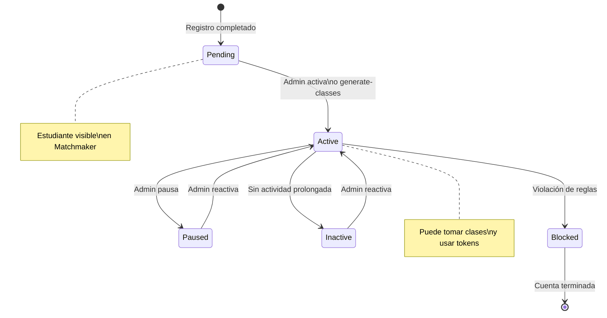

**Endpoints**:
- `GET /api/admin/students` — Listar todos con filtros
- `POST /api/admin/students` — Crear estudiante manual
- `PATCH /api/admin/students` — Actualizar campos (status, tokens, notas)
- `GET/POST/PATCH /api/admin/teachers` — CRUD similar para profesores

### 7.3 Matchmaker — Algoritmo de Grupos

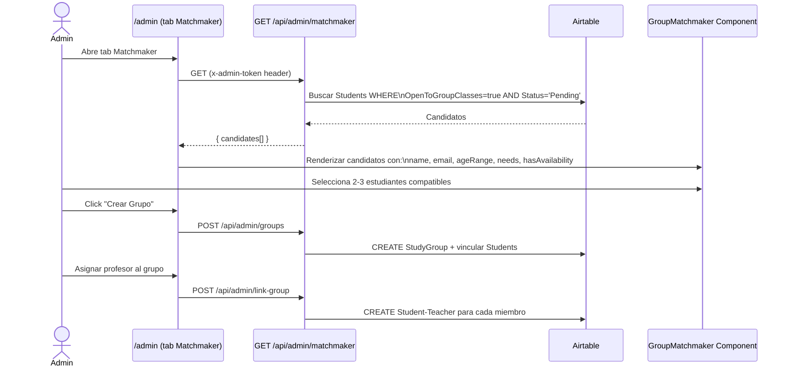

### 7.4 Generación Masiva de Clases (Holiday-Aware)

Genera N semanas de clases para un estudiante o grupo, respetando festivos colombianos.

```mermaid
flowchart TD
    A[Admin selecciona estudiante/grupo] --> B[POST /api/admin/generate-classes]
    B --> C{¿Es grupo?}
    C -->|Sí| D[Fetch StudyGroup → studentIds[]\n+ Primary Teacher]
    C -->|No| E[studentId único]
    
    D --> F[Resolver availability grid]
    E --> F
    
    F --> G{¿customAvailability\nproporcionado?}
    G -->|Sí| H[Usar custom grid]
    G -->|No| I[Fetch Availability del primer estudiante]
    
    H --> J[Iterar: semanas x slots]
    I --> J
    
    J --> K{¿Fecha es festivo\ncolombiano?}
    K -->|Sí + Community Group| L[SKIP — no crear sesión]
    K -->|Sí + Conocidos| M[Crear sesión con\nStatus='Canceled'\nIsHoliday=true]
    K -->|No| N[Crear sesión con\nStatus='Scheduled']
    
    L --> O[Siguiente slot]
    M --> P[Batch INSERT Sessions\n10 records por request]
    N --> P
    
    P --> Q[CREATE SessionParticipants\npara cada Student x Session]
    Q --> R[PATCH Students → Status='Active']
    R --> S[Respuesta: N sesiones + M participaciones creadas]
```

**Detalle clave**: Los grupos "Community" (desconocidos) NO generan clases en festivos. Los grupos "Conocidos" sí las generan pero con Status='Canceled' para que puedan confirmarlas.

### 7.5 Gestión de Series Requests

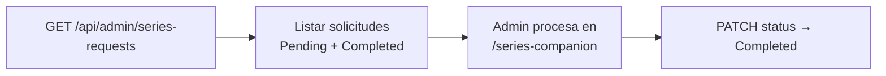

### Archivos Clave
- `pages/admin.tsx` — Panel principal (tabs: Overview, Students, Teachers, Matchmaker, Groups)
- `components/dashboard/GroupMatchmaker.tsx` — UI del matchmaker
- `pages/api/admin/students.ts` — CRUD estudiantes
- `pages/api/admin/teachers.ts` — CRUD profesores
- `pages/api/admin/matchmaker.ts` — Candidatos para grupos
- `pages/api/admin/groups.ts` — CRUD grupos de estudio
- `pages/api/admin/link-group.ts` — Vincular grupo con profesor
- `pages/api/admin/generate-classes.ts` — Generación masiva holiday-aware
- `pages/api/admin/metrics.ts` — Métricas del dashboard
- `pages/api/admin/series-requests.ts` — Gestión de solicitudes de series

---

## 8. Story Studio (`/admin/story-studio`)

Herramienta para curar y procesar historias educativas. Biblioteca de 100+ stories con procesamiento AI a nivel B2.

```mermaid
sequenceDiagram
    actor ADM as Admin/Profesor
    participant SS as /admin/story-studio
    participant API1 as API Stories
    participant LIB as lib/stories-library.ts
    participant GEM as Gemini 2.5 Flash
    participant AT as Airtable

    ADM->>SS: Accede a Story Studio
    SS->>LIB: Cargar índice de stories
    LIB-->>SS: 100+ stories (título, idioma, wordCount)

    ADM->>SS: Buscar/filtrar por idioma o keyword
    SS->>SS: Filtro local sobre índice

    ADM->>SS: Seleccionar story para procesar
    SS->>API1: POST /api/stories/process
    API1->>LIB: Obtener texto completo del story
    API1->>GEM: Prompt B2 pedagógico:\n- Fragmentar en secciones\n- Traducir frases clave\n- Extraer keywords\n- Generar preguntas de comprensión
    GEM-->>API1: Resultado procesado
    API1-->>SS: { fragments[], translations[], keywords[], questions[] }
    
    SS->>SS: Renderizar resultado procesado
    ADM->>SS: Guardar en banco de contenido
```

### Archivos Clave
- `pages/admin/story-studio.tsx` — UI del Story Studio
- `pages/api/stories/process.ts` — Procesamiento Gemini de stories
- `lib/stories-library.ts` — Textos completos de stories
- `lib/stories-index.ts` — Índice searchable (título, idioma, metadata)

---

## 9. Series Companion (`/series-companion`)

Herramienta para procesar episodios de series TV (subtítulos) y generar material pedagógico. Incluye queue de procesamiento y export a PDF.

```mermaid
stateDiagram-v2
    [*] --> Requests: Tab "Solicitudes"
    [*] --> Generator: Tab "Generador"

    state Requests {
        [*] --> LoadRequests
        LoadRequests --> MostrarLista: GET /api/admin/series-requests
        MostrarLista --> SeleccionarRequest: Admin elige solicitud
        SeleccionarRequest --> IrAGenerador: Pasar a tab Generator\ncon datos del estudiante
    }

    state Generator {
        [*] --> UploadArchivo: Drag & drop .srt/.txt
        UploadArchivo --> EnQueue: Agregar a cola
        EnQueue --> Cleaning: Estado: cleaning
        Cleaning --> Analyzing: POST /api/series/generate
        
        state Analyzing {
            [*] --> GeminiProcess
            GeminiProcess --> ParseResult
            note right of GeminiProcess: Gemini limpia subtítulos\ny genera análisis pedagógico
        }
        
        Analyzing --> Completed: Éxito
        Analyzing --> Error: Fallo
        Completed --> ExportPDF: jsPDF + html2canvas
        Completed --> CopyMarkdown: Copiar al clipboard
    }
```

### Archivos Clave
- `pages/series-companion.tsx` — UI completa (tabs requests/generator, queue, PDF export)
- `pages/api/series/generate.ts` — Procesamiento de episodios via Gemini
- `pages/api/admin/series-requests.ts` — CRUD de solicitudes

---

## 10. Motor de Contenido AI (Gemini)

### 10.1 Generación de Slides

Gemini genera 4 slides HTML dark-theme + assets de warmup/cooldown por sesión. Cada slide tiene un propósito pedagógico específico del método LDS.

```mermaid
sequenceDiagram
    participant CL as Classroom
    participant API as POST /api/generate-slides
    participant GEM as Gemini 2.5 Flash

    CL->>API: { studentName, level, vertical,\ninterests, topicName, ldsFormula,\naiContext, previousTopic }
    
    API->>API: Construir prompt con:\n- Contexto estudiante\n- LDS Formula\n- Noticias tech recientes\n- Reglas de estilo HTML

    API->>GEM: Prompt estructurado
    GEM-->>API: Texto con markers:\n[[SLIDE_1: Logic Decoder]]\n[[SLIDE_2: Colombian Filter]]\n[[SLIDE_3: Real-Life Chunks]]\n[[SLIDE_4: Conversation & News]]\n[[WARMUP_ASSETS]]\n[[COOLDOWN_ASSETS]]

    API->>API: parseSlides() → split por markers
    API->>API: parseJsonSection('WARMUP_ASSETS')
    API->>API: parseJsonSection('COOLDOWN_ASSETS')

    API-->>CL: { slides[4], warmup, cooldown }
```

**Slides generados**:
1. **Logic Decoder** — Explicación de la lógica del tema usando LDS Formula
2. **Colombian Filter** — 3 errores típicos de colombianos con corrección
3. **Real-Life Chunks** — 4-6 expresiones semi-fijas listas para usar
4. **Conversation & News** — Preguntas de conversación + "LDS Breaking News" tech

**Assets adicionales**:
- **Warmup**: icebreaker, spanglish phrases, bridge phrase
- **Cooldown**: idioms, tiny action (micro-tarea 24h), tongue twister

### 10.2 Ejercicios (12 Arquetipos LDS)

```mermaid
flowchart LR
    A[GET /api/exercises?studentId=X] --> B[Airtable: Exercises\nFIND studentId]
    B --> C[Últimos 5 ejercicios\nordenados por GeneratedAt desc]
    C --> D[Renderizar ExerciseCard\ncon generatedExample\ny solutionArchetype]
```

Los 12 arquetipos de ejercicio se inyectan en los prompts de Gemini para evitar alucinaciones y mantener coherencia pedagógica con el método LDS.

### 10.3 Scout de Videos (YouTube)

Descubre videos cortos (<70s) de hablantes nativos en YouTube, filtrando contenido educativo explícito (modo strict) y verificando que no estén ya en el Video Bank.

```mermaid
sequenceDiagram
    participant FE as Frontend
    participant API as GET /api/scout/discover
    participant SC as lib/scout.ts
    participant YT as YouTube HTML
    participant AT as Airtable

    FE->>API: ?q=topic&organic=true
    API->>SC: discoverVideos(query, organic)
    
    SC->>SC: getRandomNativeTopic() si query vacío
    SC->>YT: Fetch HTML de YouTube search\n(User-Agent spoofing, 10s timeout)
    YT-->>SC: HTML con datos de videos embebidos
    
    SC->>SC: Regex parse:\n- videoId (11 chars)\n- lengthSeconds / simpleText duration\n- title
    SC->>SC: Filtrar: duration <= 70s,\ntítulo en inglés, no educativo

    SC->>AT: Batch check Video Bank\nOR(SEARCH(id1), SEARCH(id2), ...)
    AT-->>SC: Videos ya existentes
    SC->>SC: Excluir duplicados

    SC-->>API: { videos: ScoutVideo[], debug[] }
    API-->>FE: Videos descubiertos

    Note over FE: Profesor selecciona video para guardar
    FE->>API: POST /api/scout/save
    API->>AT: CREATE en Video Bank
```

**Retry logic**: Si no encuentra resultados con query random, reintenta hasta 5 veces con diferentes topics aleatorios.

### 10.4 Video Bank Random

```mermaid
flowchart LR
    A[GET /api/video-bank-random] --> B[Airtable: Video Bank\nFiltrar por CEFR level]
    B --> C[Selección aleatoria]
    C --> D[Retornar video para\nfase Warmup de clase]
```

### 10.5 AI Chat (Copilot del Profesor)

Asistente pedagógico en tiempo real durante la clase. Usa Gemini 2.5 Flash Lite con system instruction contextual.

```mermaid
sequenceDiagram
    actor T as Profesor
    participant CL as Classroom
    participant API as POST /api/ai-chat
    participant GEM as Gemini 2.5 Flash Lite

    T->>CL: Escribe pregunta en chat
    CL->>API: { messages[], context: { studentName, level, topic } }
    
    API->>API: Construir systemInstruction:\n"Eres experto pedagógico LinguaLife.\nAlumno: X, Nivel: B2, Tema: Y"
    
    API->>API: Filtrar messages:\n- Mapear role assistant → model\n- Remover greeting inicial si role=model
    
    API->>GEM: { contents, systemInstruction }
    GEM-->>API: Respuesta en español\ncon ejemplos en inglés
    API-->>CL: { message }
    CL->>T: Mostrar respuesta en chat
```

### Archivos Clave
- `pages/api/generate-slides.ts` — Prompt engineering para slides LDS
- `pages/api/exercises.ts` — Fetch ejercicios del estudiante
- `pages/api/ai-chat.ts` — AI Copilot con Gemini Flash Lite
- `lib/scout.ts` — YouTube scraping + filtrado nativo
- `pages/api/scout/discover.ts` — Endpoint de descubrimiento
- `pages/api/video-bank-random.ts` — Video aleatorio por CEFR
- `pages/api/slides-cache.ts` — Cache de slides generados
- `components/ExerciseCard.tsx` — Renderizado de ejercicios

---

## 11. Sistema de Notificaciones

Actualmente implementado como **placeholders** (console.log). Arquitectura preparada para Twilio (WhatsApp) y SendGrid/Resend (Email).

```mermaid
flowchart TD
    subgraph Triggers
        A[Reagendamiento de clase]
        B[Confirmación de festivo]
        C[Nueva clase creada]
    end

    subgraph "lib/notify.ts"
        D[notifyReschedule]
        E[sendWhatsApp → console.log]
        F[sendEmail → console.log]
    end

    subgraph "Futuro"
        G[Twilio WhatsApp API]
        H[SendGrid / Resend Email]
    end

    A --> D
    D --> E
    D --> F
    E -.->|TODO| G
    F -.->|TODO| H
```

### Archivos Clave
- `lib/notify.ts` — Funciones placeholder: sendWhatsApp, sendEmail, notifyReschedule

---

## 12. Flujo Completo — Vista de Pájaro

```mermaid
flowchart TB
    subgraph Registro
        R1[/register/student] --> DB[(Airtable: Students\nStatus: Pending)]
        R2[/register/teacher] --> DB2[(Airtable: Teachers)]
    end

    subgraph Admin
        DB --> ADM[/admin]
        ADM --> MATCH[Matchmaker:\nCrear grupos]
        MATCH --> GEN[Generate Classes:\nN semanas holiday-aware]
        GEN --> SESS[(Sessions +\nSession Participants)]
        ADM --> CRUD[CRUD Students/Teachers\nTokens, Status]
    end

    subgraph Profesor
        SESS --> DASH[/dashboard]
        DASH --> CLASS[/classroom]
        CLASS --> SLIDES[Gemini: Slides LDS]
        CLASS --> CHAT[Gemini: AI Copilot]
        CLASS --> NOTES[Session Notes]
        DASH --> SCOUT[Scout: YouTube Videos]
        DASH --> STUDIO[Story Studio]
    end

    subgraph Estudiante
        SESS --> STU[/student]
        STU --> BOOK[Reagendar con Tokens]
        BOOK --> SESS
        STU --> RATE[Rating profesor]
        STU --> SERIES[Solicitar serie TV]
        SERIES --> SC[/series-companion]
    end

    subgraph "Motor AI"
        SLIDES
        CHAT
        STORY[Stories Processing]
        SCOUT
        STUDIO --> STORY
    end
```

---

## 13. Funcionalidades Planificadas (No Implementadas)

Basado en documentación en `_docs_md/`. Estas funcionalidades están diseñadas pero **no existen en el código actual**.

### 13.1 Pocket Coach (Bot WhatsApp)

4 micro-retos diarios de 30 segundos, personalizados según progreso del estudiante.

```mermaid
sequenceDiagram
    participant CRON as CRON Job
    participant SRV as Servidor
    participant AT as Airtable
    participant GEM as Gemini
    participant WA as Evolution API (WhatsApp)

    CRON->>SRV: Trigger cada 6 horas
    SRV->>AT: Fetch Students activos
    
    loop Para cada estudiante
        SRV->>AT: Fetch progreso + topic actual + LDS formula
        SRV->>AT: Fetch "vicious enemies" (errores fossilizados)
        SRV->>GEM: Generar micro-reto con:\n- AI guardrails (12 arquetipos)\n- Contexto del estudiante\n- Error patterns si aplica
        GEM-->>SRV: Ejercicio de 30 segundos
        SRV->>AT: LOG ejercicio en Exercises
        SRV->>WA: POST Evolution API → WhatsApp del estudiante
    end
```

### 13.2 Auto-Progresión

```mermaid
flowchart TD
    A[Profesor marca clase como\n'Completada' en /classroom] --> B[Webhook Airtable\no API callback]
    B --> C[Buscar StudentTopicProgress\ndel estudiante]
    C --> D[Marcar topic actual como\n'Completed']
    D --> E[Buscar siguiente topic\npor Order en Curriculum]
    E --> F[Crear nuevo Progress record\nStatus: 'In progress']
    F --> G[Estudiante ve nuevo\ntema en su dashboard]
```

### 13.3 Patrones de Error Fossilizados (Table 13)

```mermaid
flowchart TD
    A[Profesor identifica error\nrecurrente en clase] --> B[Registrar en Table 13:\nError Patterns]
    B --> C{¿Error se repite\n3+ veces?}
    C -->|Sí| D[Marcar como "fossilizado"]
    D --> E[Inyectar en prompts de Gemini:\nForzar arquetipo "The Sniper"]
    E --> F[Generar ejercicios\ndirigidos al error específico]
    F --> G[Pocket Coach envía\nmicro-retos enfocados]
```

### 13.4 Integración WhatsApp Real (Evolution API)

Reemplazar los `console.log` en `lib/notify.ts` con llamadas reales a:
- **Evolution API v2** (self-hosted Docker) para WhatsApp
- **Twilio** como alternativa
- **SendGrid/Resend** para email

**Infraestructura planeada**: GCP e2-micro (Ubuntu 22.04) IP 136.113.200.239, Docker con Evolution API + n8n para orquestación.

---

## Apéndice: Referencia Rápida de Endpoints

| Método | Ruta | Descripción |
|--------|------|-------------|
| POST | `/api/validate-unified` | Login por PIN |
| POST | `/api/register/student` | Registro estudiante |
| POST | `/api/register/teacher` | Registro profesor |
| GET | `/api/register/global-availability` | Heatmap disponibilidad |
| GET | `/api/register/community-availability` | Overlap disponibilidad |
| GET | `/api/sessions` | Listar sesiones |
| GET | `/api/session` | Detalle de sesión |
| POST | `/api/confirm-holiday` | Confirmar festivo |
| POST | `/api/reschedule-session` | Reagendar sesión |
| GET | `/api/topic` | Obtener tema |
| GET | `/api/curriculum-nav` | Navegación currículo |
| GET | `/api/student-progress` | Progreso del estudiante |
| GET | `/api/exercises` | Ejercicios del estudiante |
| POST | `/api/generate-slides` | Generar slides AI |
| GET | `/api/slides-cache` | Cache de slides |
| POST | `/api/session-notes` | Guardar notas |
| GET | `/api/next-session` | Próxima sesión |
| GET | `/api/previous-notes` | Notas anteriores |
| POST | `/api/ai-chat` | AI Copilot |
| GET | `/api/studio` | Datos studio profesor |
| GET | `/api/video-bank-random` | Video aleatorio |
| GET | `/api/scout/discover` | Descubrir videos YouTube |
| POST | `/api/scout/save` | Guardar video al banco |
| GET/POST | `/api/stories/process` | Procesar stories |
| POST | `/api/series/generate` | Procesar episodio serie |
| GET | `/api/student/teacher-availability` | Disponibilidad profesor |
| POST | `/api/student/redeem-token` | Redimir token |
| POST | `/api/student/rate-teacher` | Calificar profesor |
| POST | `/api/student/series-request` | Solicitar serie |
| GET/PATCH | `/api/teacher/availability` | CRUD disponibilidad |
| GET/POST/PATCH | `/api/admin/students` | CRUD estudiantes |
| GET/POST/PATCH | `/api/admin/teachers` | CRUD profesores |
| GET | `/api/admin/matchmaker` | Candidatos matchmaker |
| GET/POST/PATCH | `/api/admin/groups` | CRUD grupos |
| POST | `/api/admin/link-group` | Vincular grupo-profesor |
| POST | `/api/admin/generate-classes` | Generación masiva |
| GET | `/api/admin/metrics` | Métricas plataforma |
| GET/PATCH | `/api/admin/series-requests` | Solicitudes de series |
