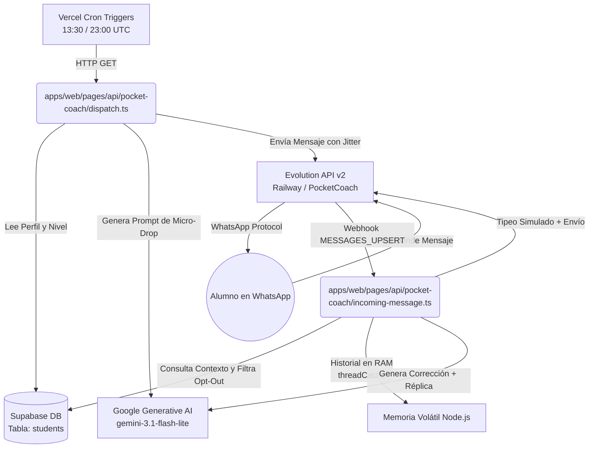

# INFORME TÉCNICO Y ARQUITECTURA: POCKET COACH (LINGUALIFE)
> **Versión del Sistema:** MVP v1.2  
> **Fecha de Instantánea (Snapshot):** Septiembre 2026  
> **Propósito:** Registro técnico integral del funcionamiento, infraestructura, prompts, bases de datos y ciclo de vida del Pocket Coach de LinguaLife.

---

## 1. RESUMEN EJECUTIVO Y OBJETIVOS

El **Pocket Coach** es el motor de refuerzo conversacional y asíncrono de LinguaLife en WhatsApp. Su misión es mantener al estudiante inmerso en el idioma inglés mediante:
1. **Push (Micro-Drops Programados):** Envíos dos veces al día (mañana y tarde) con retos breves de 1 o 2 líneas basados en el tema curricular actual del estudiante o sus debilidades.
2. **Pull (Tutor Conversacional Dinámico):** Interacción en tiempo real cuando el alumno responde. Corrige errores sutilmente, modela la respuesta correcta de forma natural y formula una pregunta de seguimiento para mantener el hilo conversacional.

---

## 2. INFRAESTRUCTURA Y COMPONENTES

### 2.1 Proveedores y Puntos de Conexión
* **Gateway WhatsApp:** Evolution API v2 alojada en Railway (`https://evolution-api-production-0971.up.railway.app`).
  * **Instancia:** `PocketCoach`.
  * **Estado operativo:** `open` (conectada).
* **Base de Datos:** Supabase PostgreSQL (`https://swmklobpnrkjpfackboc.supabase.co`).
* **Hosting Backend / Serveless:** Vercel (`https://lingualife.vercel.app`).
* **Proveedor de IA:** Google Generative AI (Gemini API).

---

## 3. MOTOR DE INTELIGENCIA ARTIFICIAL (CASCADA Y OPTIMIZACIÓN)

Ubicación: [`apps/web/lib/pocket-coach/prompt-engine.ts`](file:///media/xao/CCF89F8FF89F7684/Documentos/Antigravity/LinguaLife/apps/web/lib/pocket-coach/prompt-engine.ts)

### 3.1 Cascada de Modelos (Model Fallback Cascade)
Para maximizar la rentabilidad y resiliencia sin exceder cuotas ni generar costos desmedidos, el sistema opera con una cascada de modelos económicos (`flash-lite`):
1. **Primario:** `gemini-3.1-flash-lite` (Ultra-rápido, consumo mínimo de tokens).
2. **Fallback Secundario:** `gemini-3.5-flash-lite`
3. **Fallback Terciario:** `gemini-flash-lite-latest`
4. **Fallback Final de Seguridad:** `gemini-3.5-flash`

### 3.2 Prompt Maestro: Motor 1 (Micro-Drops / Outgoing Dispatch)
* **Objetivo:** Retar al estudiante con base en el tema actual que está viendo en clase.
* **Directrices:**
  * Máximo 1–2 oraciones (menos de 40 palabras).
  * Directo, amigable y desafiante.
  * Sin formato tipo robot ("*Hello Student! Today's challenge is...*"). En su lugar: tono natural de mensajería instantánea.
  * Formular 1 sola pregunta clara y abierta.

### 3.3 Prompt Maestro: Motor 2 (Tutor Reactivo / Incoming Message)
* **Objetivo:** Responder al estudiante cuando contesta al chat.
* **Directrices:**
  1. **Longitud:** Máximo 2 oraciones breves (estilo WhatsApp).
  2. **Técnica de Corrección Silenciosa / Modelado:** No dar sermones gramaticales largos. Si comete un error, se incorpora la forma correcta de manera conversacional y fluida.
  3. **Seguimiento Dinámico:** Finalizar siempre con una pregunta concisa para invitar a otra respuesta.
  4. **Nivel:** Mantener el nivel de inglés según el perfil (`level`: A1, A2, B1, B2, etc.). Si el alumno habla en español y es nivel inicial, se le puede dar un empujón bilingüe cordial; si es intermedio/avanzado, 100% en inglés.

---

## 4. BASE DE DATOS Y GESTIÓN DE ESTADO (ZERO-WRITE IN RAM)

### 4.1 Campos Leídos de `students` (Supabase)
| Campo | Tipo | Uso en Pocket Coach |
| :--- | :--- | :--- |
| `id` | UUID | Identificador unívoco del estudiante. |
| `name` | String | Nombre de pila para personalizar el saludo. |
| `phone` | String | Número internacional normalizado para el despacho. |
| `status` | String | Filtro obligatorio: solo se despacha si está en `Active`. |
| `level` | String | Nivel actual (ej. `A2`, `B1`, `B2`). |
| `current_topic` | String | Tema de estudio actual para alinear el reto diario. |
| `notes` | Text | Notas pedagógicas fijas dejadas por el profesor titular. |

### 4.2 Arquitectura "Zero DB Writes" para Historial Conversacional
* **Problema Previo:** Escribir cada intercambio en el campo `notes` de Supabase generaba un alto I/O en la base de datos y corría el riesgo de sobrescribir observaciones pedagógicas importantes del profesor.
* **Solución Implementada:** 
  * Se eliminaron por completo las escrituras a Supabase durante el flujo conversacional reactivo.
  * **Buffer Volátil en Memoria (`threadCache`):** Almacena en memoria RAM de Node.js únicamente los últimos **4 mensajes** (2 del alumno, 2 del coach) truncados a un máximo de 140 caracteres cada uno.
  * **Expiración de Memoria:** TTL de 30 minutos. Tras ese periodo, el hilo se renueva automáticamente.

---

## 5. CICLO DE VIDA Y DISPARADORES (TRIGGERS)

### 5.1 Programación Vercel Crons
Ubicación: [`apps/web/vercel.json`](file:///media/xao/CCF89F8FF89F7684/Documentos/Antigravity/LinguaLife/apps/web/vercel.json)
* **Mañana:** `30 13 * * *` (13:30 UTC = 8:30 AM Hora Colombia / COT).
* **Tarde:** `0 23 * * *` (23:00 UTC = 6:00 PM Hora Colombia / COT).
* **Días:** Los 7 días de la semana (`* * *`, incluyendo sábados y domingos según solicitud de práctica continua).
* **Ruta Invocada:** `GET /api/pocket-coach/dispatch` protegida con `CRON_SECRET`.

### 5.2 Recepción Webhook (Incoming Webhook)
Ubicación: [`apps/web/pages/api/pocket-coach/incoming-message.ts`](file:///media/xao/CCF89F8FF89F7684/Documentos/Antigravity/LinguaLife/apps/web/pages/api/pocket-coach/incoming-message.ts)
* **Evento:** `MESSAGES_UPSERT` emitido por Evolution API.
* **Filtros de Seguridad del Webhook:**
  * **Mensajes Propios (`key.fromMe = true`):** Se descartan inmediatamente para evitar bucles infinitos de eco.
  * **Grupos (`@g.us`):** Se descartan inmediatamente. Solo atiende chats directos (`@s.whatsapp.net`).
  * **Broadcasting / Newsletters (`status@broadcast`):** Ignorados.
  * **Mapeo de Identificadores LID:** Normaliza identificadores de WhatsApp (`@lid`) al formato telefónico estándar.
  * **Comandos de Salida / Opt-Out:** Si el alumno escribe `STOP`, `PAUSE`, `DETENER` o `CANCELAR`, el coach responde con cortesía confirmando la pausa y no insiste.

---

## 6. ANTI-SPAM, JITTER Y ANÁLISIS DE ESPACIADO (SPACING)

### 6.1 Mecanismos Actuales de Seguridad Operativa
1. **Comportamiento Humano Simulado (`sendWhatsAppMessage`):**
   * Emite el estado `composing` (tipeando...) durante 2 a 3.5 segundos antes de entregar el mensaje al webhook.
2. **Jitter entre Estudiantes (`dispatch.ts`):**
   * Antes de procesar y enviar a cada estudiante subsiguiente, el código aplica una pausa aleatoria:
   $$\text{Jitter} = 4000\text{ ms} + \text{random}(0, 5000)\text{ ms} \quad (4\text{ a }9\text{ segundos})$$

### 6.2 Diagnóstico: ¿Por qué llegaron en el mismo minuto anoche?
* **Cálculo de ejecución con 3 estudiantes activos:**
  * Estudiante 1: Envío a los $0\text{s}$.
  * Estudiante 2: Espera $\sim 5.2\text{s}$ $\rightarrow$ Envío a los $5.2\text{s}$.
  * Estudiante 3: Espera $\sim 6.1\text{s}$ $\rightarrow$ Envío a los $11.3\text{s}$.
  * **Tiempo total del lote:** $\sim 12$ segundos.
* **Conclusión Técnica:** Con una base pequeña de 3 alumnos de prueba, una separación de 4 a 9 segundos hace que todo el ciclo concluya en menos de 20 segundos, por lo que en el registro de WhatsApp los tres mensajes quedan marcados dentro del mismo minuto (ej. 8:30 PM).

### 6.3 Recomendación de Escala Futura para Espaciado Amplio
* En el plan serverless actual de Vercel, una función `serverless` tiene un tiempo límite de ejecución (*execution timeout* de 10 a 60 segundos). No es seguro hacer un `sleep` de 1 a 2 minutos entre estudiantes dentro de la misma petición HTTP porque Vercel cancelaría la función con error `504 FUNCTION_INVOCATION_TIMEOUT`.
* **Solución lista para cuando la base de alumnos crezca:**
  1. Encolar los envíos a través de un scheduler asíncrono (como **Upstash QStash** o una tabla de cola en Supabase).
  2. O delegar el delay a la opción nativa de programación con retardo (`delay`) que soporta Evolution API al momento de publicar el mensaje.

---

## 7. MATRIZ DE CONFIGURACIÓN Y VARIABLES DE ENTORNO

| Variable | Descripción | Entorno |
| :--- | :--- | :--- |
| `GEMINI_API_KEY` | Llave de acceso para la API de Google Gemini. | Vercel & Local |
| `EVOLUTION_API_URL` | Endpoint base de Evolution API v2 en Railway. | Vercel & Local |
| `EVOLUTION_API_KEY` | Token de autenticación para la Evolution API. | Vercel & Local |
| `CRON_SECRET` | Token Bearer para autenticar las llamadas de Vercel Cron. | Vercel & Local |
| `NEXT_PUBLIC_SUPABASE_URL` | URL del proyecto Supabase. | Vercel & Local |
| `SUPABASE_SERVICE_ROLE_KEY` | Llave con permisos de backend para consultar alumnos. | Vercel & Local |

---

## 8. ESTADO DE PRUEBAS Y ESTUDIANTES ACTIVOS

| Alumno | Teléfono | Nivel | Estado en Pocket Coach |
| :--- | :--- | :--- | :--- |
| **Sebastián Vélez** | `573207347611` | B1 | Activo (Verificado en producción) |
| **Romario** | `+573007696101` | A2 | Activo (Verificado en producción) |
| **Laura** | `+573197693120` | B2 | Activo (Verificado en producción) |

---
*Fin del informe de arquitectura técnica. Documento generado para servir de referencia de producción en LinguaLife.*
